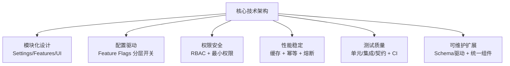

# 核心技术

> **副标题**：稳定、安全、可扩展的特性配置与权限管控平台

---

## 要点（6 条，适合单页 PPT）

1. **模块化架构设计**
   仓库按领域划分为 Settings / Features / Permissions / UI 等独立模块，单一职责、低耦合，便于团队并行迭代与独立部署。（`copilot/c/settings/copilot/features` 路径相关模块结构——**待确认/可选**：仓库当前未发现对应源码目录，如后续补充请在此替换。）

2. **配置驱动 × 功能开关（Feature Flags）**
   通过分层开关模型（全局 → 组织 → 用户）控制功能灰度与快速回滚；配置与代码解耦，支持不停机热更新。（**待确认/可选**：如仓库实现了 Feature Flag 服务，请补充具体实现技术，如 LaunchDarkly / 自研规则引擎。）

3. **权限与安全体系（RBAC + 最小权限）**
   基于角色的访问控制（RBAC）结合属性策略（ABAC）；默认拒绝原则，按需授权；敏感配置加密存储、变更可审计；满足企业级合规要求。（**待确认/可选**：具体权限模型依赖仓库实现。）

4. **性能与稳定性保障**
   热点配置多级缓存（内存 → 分布式缓存）；配置写操作幂等设计，防并发冲突；关键链路降级与熔断，保障核心服务可用性。（**待确认/可选**：缓存中间件（如 Redis）及熔断框架依赖仓库实际技术栈。）

5. **自动化测试与持续集成**
   覆盖单元测试、集成测试、契约测试多层次质量门禁；CI 流水线自动运行，确保每次提交可信；变更审查（Code Review）与测试覆盖率双重保障。（**待确认/可选**：具体测试框架与 CI 工具（如 Jest / Go test / GitHub Actions）依赖仓库实际配置。）

6. **可维护性与扩展性**
   Schema/Model 可扩展设计，新增功能模块无需大改现有页面结构；统一组件体系（表单、校验、错误态）保障 UI 一致性；接口约定与开发规范文档化，降低新人上手成本。

---

## 技术栈（待确认）

> 当前仓库（985211-max/987）未检测到源码文件，以下技术栈为**占位建议**，请根据真实实现替换：

| 层次 | 技术（待确认） |
|------|--------------|
| 前端 | React / Vue / TypeScript（待确认） |
| 后端 | Go / Node.js / Java（待确认） |
| 数据存储 | PostgreSQL / MySQL（待确认） |
| 缓存 | Redis（待确认） |
| CI/CD | GitHub Actions（待确认） |
| 容器化 | Docker / Kubernetes（待确认） |

---

## 可视化排版建议

### 推荐版式

**两栏布局**（最适合 6 条要点）

- **左栏**（3 条）：架构与配置驱动、权限与安全体系、性能与稳定性
- **右栏**（3 条）：自动化测试与 CI、可维护性与扩展性、技术栈概览
- 每条要点字数建议：**标题 8～12 字，正文 20～30 字**（不超过 1 行说明）

**备选：图标 + 要点列表**

每条要点配一个行业通用 emoji 图标（⚙️ 🔒 🚀 🧪 🔧 📦），视觉层次更清晰，适合面向非技术受众。

---

### 简易示意图（Mermaid）



> **ASCII 备选**（适合不支持 Mermaid 的工具）：
>
> ```
>            ┌─────────────────────────────┐
>            │        核 心 技 术           │
>            └────────────┬────────────────┘
>      ┌──────────────────┼──────────────────┐
>      ▼                  ▼                  ▼
> ┌─────────┐       ┌──────────┐       ┌──────────┐
> │ 架构工程 │       │ 安全权限 │       │ 性能稳定 │
> │模块化设计│       │RBAC+审计 │       │缓存+熔断 │
> └─────────┘       └──────────┘       └──────────┘
>      ┌──────────────────┼──────────────────┐
>      ▼                  ▼                  ▼
> ┌─────────┐       ┌──────────┐       ┌──────────┐
> │ 功能开关 │       │ 测试质量 │       │ 可扩展性 │
> │Feature Flag│     │ CI 流水线│       │Schema驱动│
> └─────────┘       └──────────┘       └──────────┘
> ```
